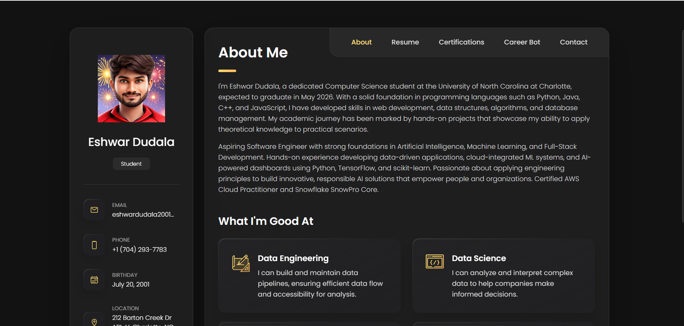
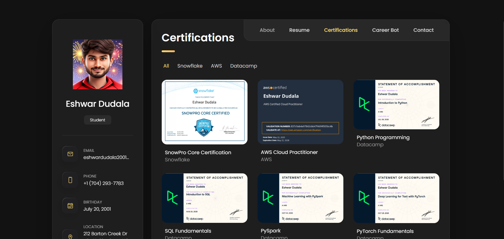
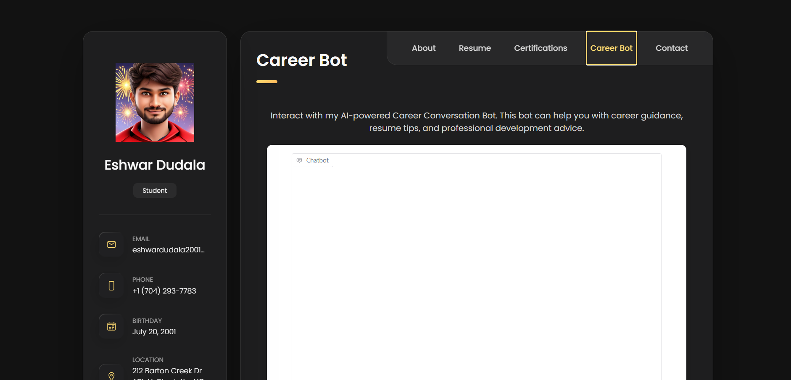
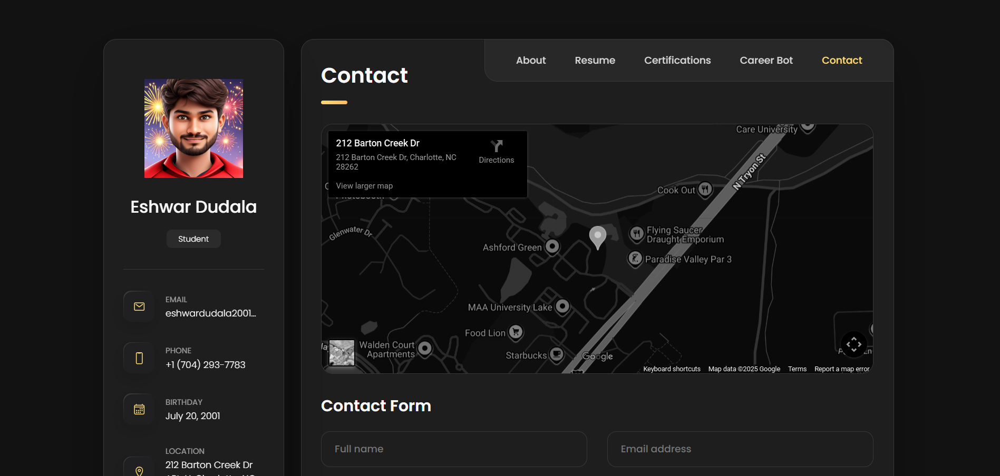

The rewritten markdown content that would fit at $SELECTION_PLACEHOLDER$ wrapped with -+-+-+-+-+ is:

## Live Site

The active web-hosted live site can be viewed at [https://eshwardudala.github.io/portfolio/](https://eshwardudala.github.io/portfolio/)

## Features

- Responsive layout (mobile-first)
- Sections for About, Resume, Certifications, Career Bot, and Contact
- Smooth scroll and simple JavaScript interactions
- Easy to customize (single-page static site)

## What this site contains

1. **About**
  - Concise professional summary highlighting background, core strengths, and career focus
  - Key technical and non-technical skills (e.g., languages, frameworks, tooling, soft skills)
  - High-level accomplishments and value proposition (what the person does best and how they add impact)

2. **Resume**
  - Chronological and/or functional overview of education, certifications, and professional experience
  - Role descriptions with responsibilities, measurable outcomes, and notable projects
  - Links to downloadable resume (PDF) and detailed project case studies where relevant

3. **Certifications**
  - Curated list of verified certifications grouped by sub-domain (e.g., Cloud & DevOps, Web Development, Data Science, Security)
  - For each certificate: title, issuing organization, date, and credential ID or verification link when available
  - Emphasis on how each certification supports the candidate’s expertise and real-world work

4. **Career Bot**
  - Interactive chatbot that answers career-related questions about the portfolio owner (background, skills, availability)
  - Provides a recommended contact email for direct outreach
  - Fallback behavior: if the bot cannot confidently answer a query, it logs or forwards the question to the portfolio owner for personal response
  - Privacy note: brief mention that contact requests are used only to facilitate introductions and follow-ups

5. **Contact**
  - Primary contact methods: professional email and LinkedIn profile
  - Additional channels: WhatsApp (business) link and optional physical address or city/location for context
  - Preferred contact guidelines (best times to reach, expected response time) and a short call-to-action for hiring, collaboration, or speaking requests

## Demo

Here's a preview of the portfolio sections:

<div align="center">
  
</div>

<div style="display: grid; grid-template-columns: repeat(2, 1fr); gap: 20px; margin: 20px 0;">
  
  
</div>

<div style="display: grid; grid-template-columns: repeat(2, 1fr); gap: 20px; margin: 20px 0;">
  
  
</div>

## Tech Stack

### Open Locally (any of the options below)

- **Quick:** Open the file directly
  - In your file manager or editor, open `index.html`.

- **Serve with a Simple HTTP Server (recommended)**
  - Using Python 3:
   ```bash
   python3 -m http.server 8000
   ```
   Then open http://localhost:8000 in your browser:
   ```bash
   "$BROWSER" http://localhost:8000
   ```

  - Using VS Code: Install the Live Server extension and click "Go Live".

### Make Changes and Refresh the Page

## Build & Deploy

This is a static site — to deploy, you can use GitHub Pages:

1. Push your branch to GitHub
  ```bash
  git add .
  git commit -m "Update site"
  git push origin main
  ```

## Contributing

- Fork the repo, create a branch, make changes, and open a PR
- Keep styles and markup simple. Add unit tests only if you introduce build tooling

## Contact

Find me on Twitter: [LinkedIn Profile](https://www.linkedin.com/in/eshwar-dudala-788868208/)


